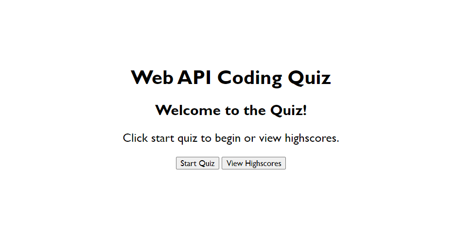

# glowing-enigma-module-04-challenge
Module 04 Challenge

## Description

This web application is a coding quiz.  It contains multiple choice questions on the topic of Web APIs.  The application will track your score for each of your attempts.

## Installation

N/A

## Usage

The application can be accessed at this URL: 

To begin the quiz, click on the start quiz button.  Answer each question by selecting one of the multiple choice options.  You will receive an alert to let you know if you answered correctly or not.  The quiz will be completed when either all of the questions are answered or the remaining time runs out.  Answering a question correctly will add to your score.  Answering incorrectly will remove time from the timer.  When the quiz is complete, you can view your score and track scores from previous attempts.  You can also clear the scores to start fresh.

Coding Quiz Screenshot:

## Credits

N/A

## License

N/A